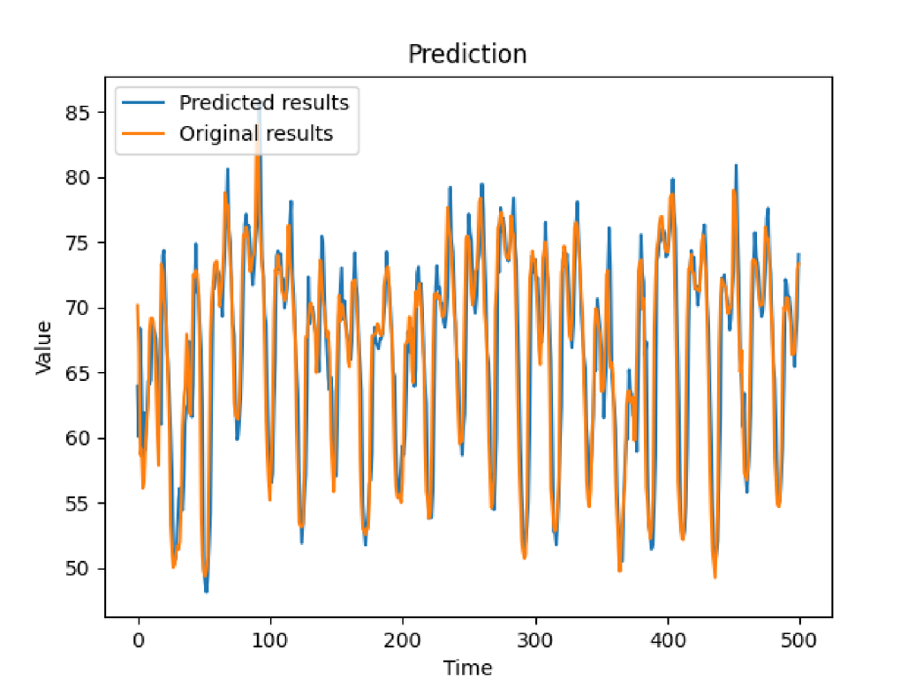
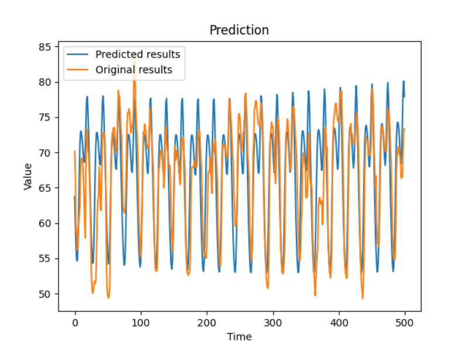
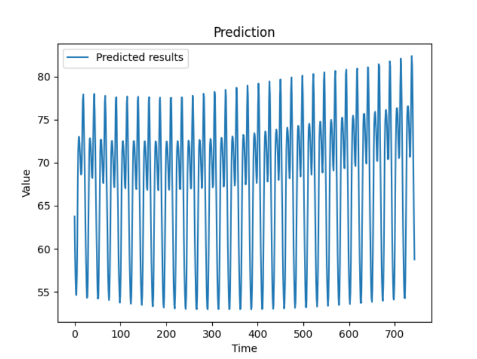

This project is meant to be a plug and play template, for anyone looking to build a univariate forecasting model using LSTM, GRU or RNN.
This can run on pretty much any univariate forecasting data, as long as it's correctly formatted,
as seen in the data/rt_benchmark_datasets. This capability is achived because it uses BayesianOptimization of Keras Tuner to find the right hyperparameters.
Other hyperparameters are automatically inferred by the program by looking at the properties of the data.
To have a quick look at how to execute this program, and which functions do what, check the _Run.py_ program and
have a look at the functions it calls for each user choice.

The program was tested on python 3.10.8, tensorflow 2.10.0 and was tested on windows 11 with a GTX 1080ti. It should work on other hardware and OS was well.

# Input File Info:

_data/input_folder/data_train.csv_

The above file should contain the data you wish to train on.
Rename the target csv file and make sure the file name is the exact same as above.
This data will be used to forecast and make future predictions.
(Example: *___train.csv__ in forecasting base can be renamed to __data_train.csv__)

_data/input_folder/data_test.csv_

The above file should contain the keys to test the model during forecasting. If data_train.csv contains 500 days of data, and you are trying to test
the model performance for the next 100 days. This file should contain those 100 days of data.
(Example: *__test_keys.csv__ in forecasting base can be renamed to __data_test.csv__)

# How to run the program:
- **Run setup.py**
- **Save** your train and test csv's in the data/input_folder,
as _data_train.csv_ and _data_test.csv_ respectively.(Look at data/rt_benchmark_datasets).
- **Set virtual environment** in windows by running `venv/Scripts/activate`. This allows you to run it without installing anything else, but make sure you have your GPU setup.
Else install the requirements in other operating systems. 
- **Use run.py** to run the program.
- **Set choices** for, which column contains the data you wish to forecast,
and choose the index name of the data you wish to pull you. These values
will be saved unless changed in the same way. Next, set the forecasting you'd like to use to train.
You'll be asked to choose from 3 options:
  - LSTM
  - RNN
  - GRU
- **Tune the hyperparameters** automatically to fit the new data. After this
is done, the best hyperparameters will be saved
- **Train** a new model with the saved hyperparameters
- You can now **forecast** using the various options available, using the saved model.

# Forecasting options:

### Option 1:
_(t+1) prediction_ means that you will be predicting only for the next day (t+1). To predict (t+2), 
t+1 will be the original correct value from the test set, and not the predicted value. This can obviously be more accurate,
because the model only predicts one day ahead, so that minor or major errors don't compound over time.

#### **t+1 prediction on test set of energy demand prediction data on LSTM:**

### Option 2:

The program can also forecast for x days without appending from the test set. 
Although it doesn't append from the test set, it can still test against it, as seen below.

#### **t+500 prediction compared against test set of energy demand prediction data on GRU:**

### Option 3:

This option allows you to blindly predict for as many days as you like, even if there is 
no test set to compare against. 

#### **t+500 prediction without test set of energy demand prediction data on RNN:**

